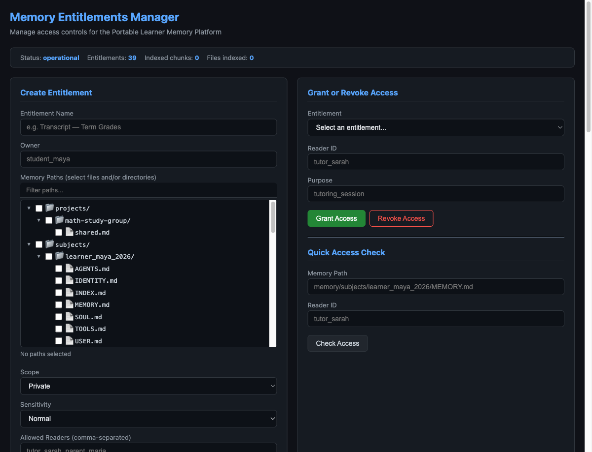
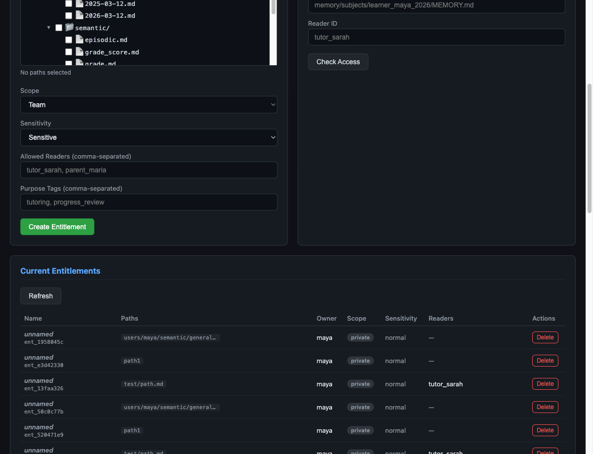
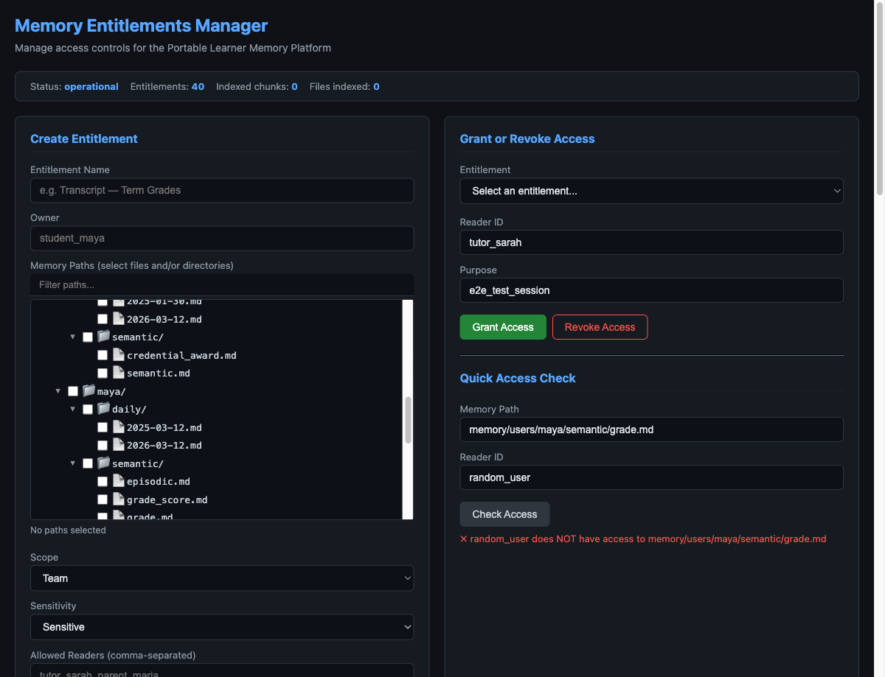
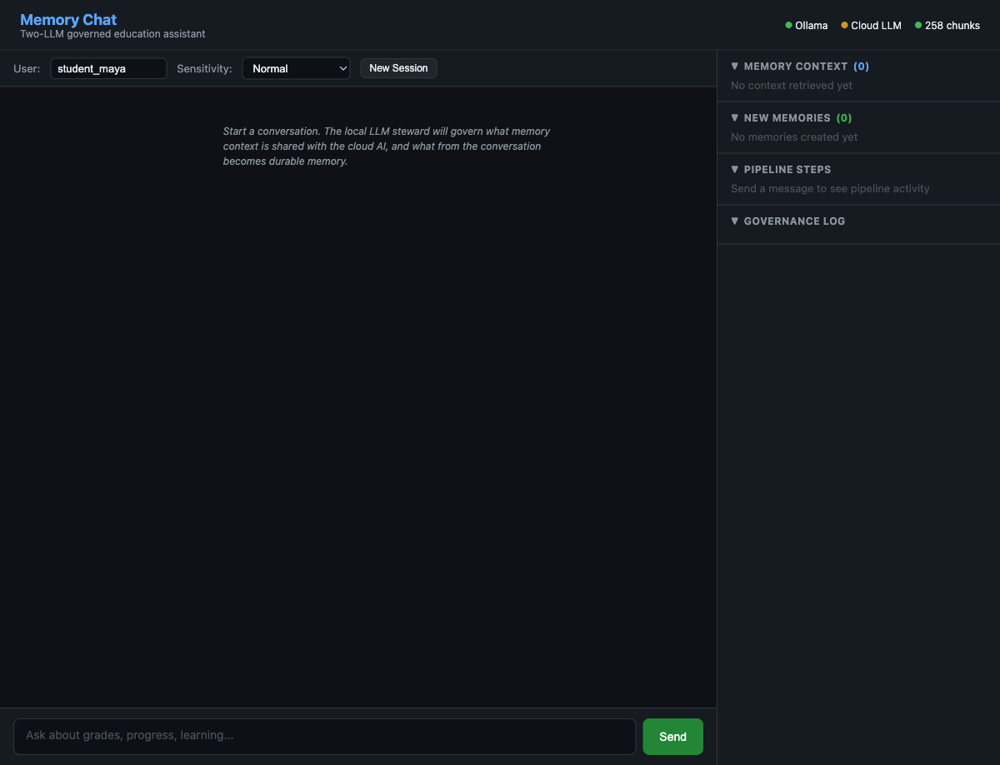
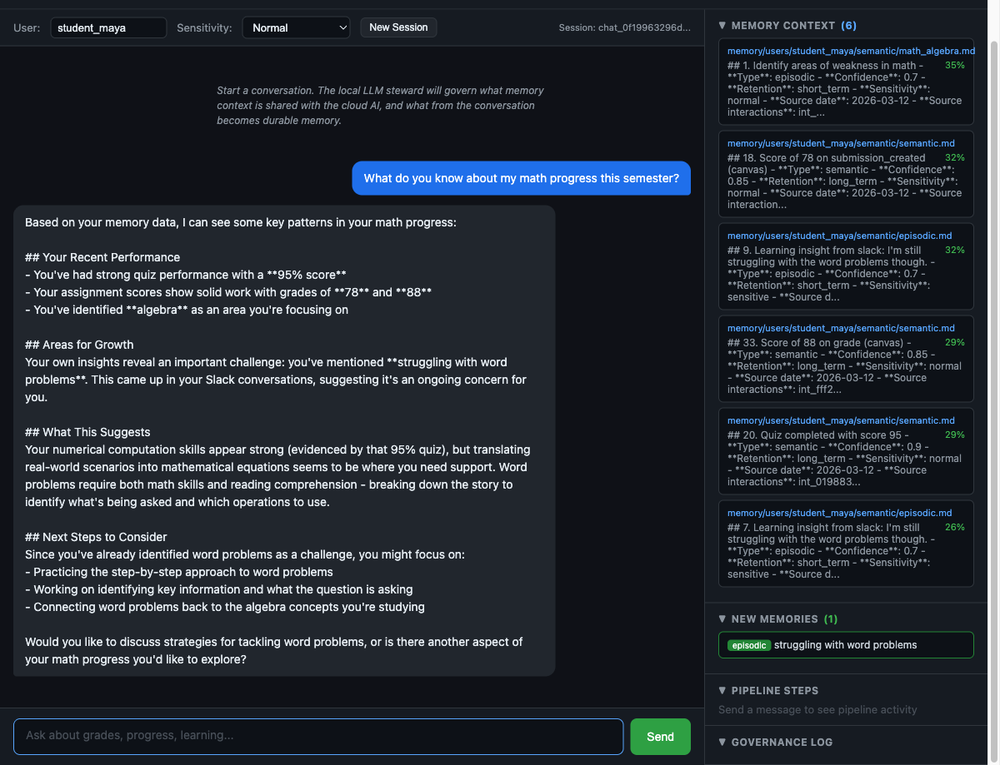
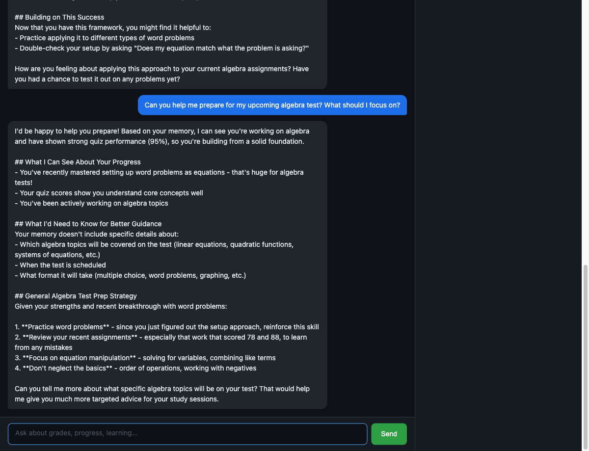

# Portable Learner Memory Platform

An education-first, **user-governed portable memory API**. A learner carries their context — identity, preferences, mastery, errors, accommodations — across AI tutors and learning tools as six semantic Markdown documents, and decides via entitlements what each tool is allowed to read or write.

The filesystem is the source of truth. The vector index is derived and rebuildable. Governance is enforced **before** retrieval, not bolted on after.

## The six documents

Each learner's memory lives in plain Markdown with YAML front matter, organized into sections tagged with a hierarchical `domain_path` (e.g. `math/fractions/mixed_numbers`).

| Document | Purpose |
|---|---|
| `AGENTS.md` | Policies and constraints the learner imposes on AI |
| `SOUL.md` | Learning identity, values, motivation |
| `IDENTITY.md` | Current role, school, grade |
| `USER.md` | Preferences, accessibility, accommodations |
| `TOOLS.md` | Integrations and per-tool configs |
| `MEMORY.md` | Mastery levels, error patterns, inferences, events |

Sections roll up into an auto-generated `INDEX.md` with an ASCII domain tree and mastery bars, regenerated on every write.

## Access control — two layers, governance-first

1. **Entitlements** — 9 named profiles that scope access by *document type* + *section kind* (e.g. "tutor can read MEMORY mastery+errors in `math/*`, cannot read SOUL"). Bound to a requester via a time-limited **Grant** (entitlement + requester + subject + duration).
2. **Sharing scopes** — per-file ACL stored in frontmatter: `private | project | team | global`, with explicit reader lists.

When a tool asks for context, the platform builds a `ContextBundle` filtered by the active grant. The tool only ever sees sections it is entitled to. Filters apply **before** vector similarity search.

## Architecture

```
Connectors → Daily logs → LLM Steward → Memory Router → 6 MD docs
                                                           ↓
                              Entitlement filter ← Retriever ← Vector index
                                        ↓
                                 ContextBundle → AI tool
```

- **Connectors** (`app/connectors/`) — normalize events from Canvas LMS, Slack, 1EdTech LIF
- **Daily logger** (`app/daily_logger.py`) — appends interactions to daily Markdown logs
- **LLM steward** (`app/llm_steward.py`) — decides what's worth promoting to long-term memory (ethics prompt in `prompts/`)
- **Memory router** (`app/memory_router.py`) — writes to the correct semantic doc by type/scope
- **Embedding indexer** (`app/embedding_indexer.py`) — SQLite vector DB, rebuildable from Markdown
- **Retriever** (`app/retriever.py`) — applies governance filters, then similarity search
- **Entitlements** (`app/entitlements.py`, `app/entitlement_service.py`) — profiles, grants, per-file CRUD
- **Sharing** (`app/sharing.py`) — scope enforcement

## Quickstart

```bash
# Install
pip install -r requirements.txt

# Run the server
uvicorn app.main:app --reload --port 8000

# Populate sample data and view the domain tree
python client_demo.py
```

Then open:

- `http://localhost:8000/docs` — API reference
- `http://localhost:8000/ui` — entitlements management UI
- `http://localhost:8000/chat/ui` — two-LLM chat (local Ollama governs context, cloud LLM responds)
- `http://localhost:8000/tree/{subject}/markdown` — live INDEX.md for a learner

## Demo flow

1. `python client_demo.py` — populates 27 sections across math, reading, science; prints the rolled-up domain tree.
2. Open `/tree/learner_maya_2026/markdown` — inspect the auto-built INDEX with mastery bars.
3. Open `/ui` — create an entitlement and grant for a "math tutor" requester.
4. Open `/chat/ui` — ask a question; observe that only entitled sections appear in the context bundle.
5. Revoke the grant — the same query now returns a narrower bundle.

## What it looks like

### Entitlements Manager (`/ui`)

The owner picks files or directories from the learner's memory tree, sets a scope (`private | project | team | global`) and sensitivity, names the allowed readers, and tags the purpose. Grants and revocations are issued per reader from the right-hand panel, and a quick access check confirms what a given reader can or cannot see.



### Entitlement created and listed

Once created, entitlements appear in the **Current Entitlements** table with their paths, owner, scope, sensitivity, and reader list. Each one is independently revocable.



### Access check denies an unauthorized reader

A reader without a matching entitlement is rejected by the **Quick Access Check** panel before any retrieval happens — governance is enforced at the file level, not after the fact.



### Two-LLM governed chat (`/chat/ui`)

The chat UI is split: conversation on the left, a live **governance sidebar** on the right showing the memory context retrieved, new memories created from this turn, pipeline steps, and a governance log. Status pills at the top confirm Ollama (local steward) and the cloud LLM are healthy.



### Chat with governed memory in action

When the learner asks about their performance, the local Ollama steward pulls only entitled context (visible in the right pane), passes it to the cloud LLM, and writes durable memories back through the router.



A follow-up turn — preparing for an algebra test — reuses the same governed context and adds new memories from the interaction.



## Conventions

- Python 3.12+, FastAPI, Pydantic v2, numpy
- Markdown is canonical storage; the vector DB is a derived index
- `memory/subjects/` and `memory/users/` are gitignored (runtime data)
- IDs: `sec_{hex[:8]}`, `grant_{hex[:8]}`, `int_{hex[:12]}`, `ent_{hex[:8]}`
- LLM steward defaults to a rule-based mock; set `STEWARD_BACKEND=llm` for Ollama
- Embedder defaults to hash-based; install `sentence-transformers` for real semantics

## Tests

```bash
pytest tests/ -v
pytest tests/test_api.py::test_name -v   # single test
```

## Why this is a useful starting point

- Storage is just Markdown — easy to inspect, diff, and version.
- The vector index is derived, so the canonical record stays human-readable and portable.
- Governance is enforced before retrieval, not bolted on after — the right pattern when AI tools start asking for student data.
- Clear seams: connectors, steward, router, retriever, entitlements — each is roughly one file and easy to swap.
